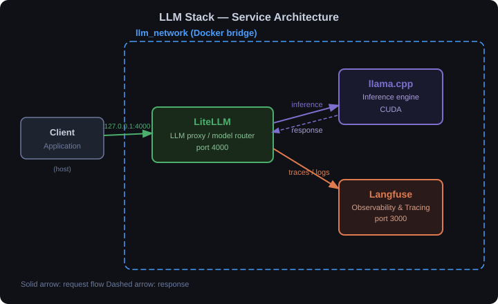

# LLM Stack

A self-hosted LLM serving stack composed of three independent services connected via a shared Docker network.

| Service | Role | Port |
|---|---|---|
| **llama.cpp** | Local model inference server (CUDA) | — |
| **LiteLLM** | LLM proxy + model router | 4000 |
| **Langfuse** | LLM observability & tracing UI | 3000 |

## Architecture



## Services

- **llama.cpp** — LLM inference engine in C/C++ with minimal dependencies and state-of-the-art performance across a wide range of hardware.
- **LiteLLM** — Python SDK and proxy server (AI Gateway) to call 100+ LLM APIs, with load balancing, cost tracking, and logging. Config: `litellm/config.yaml`. API at `http://localhost:4000`.
- **Langfuse** — Open-source LLM engineering platform for observability, prompt management, evaluations, and debugging of LLM applications. UI at `http://localhost:3000`.

## Configuration

All services share a single root `.env` file. Copy the example and fill in your values before starting:

```bash
cp .env.example .env
```

Secrets marked `# CHANGEME` must be updated before running in production.

## Startup

```bash
docker network create llm_network   # once only

docker compose --env-file .env -f llama.cpp/compose.yaml up -d
docker compose --env-file .env -f litellm/compose.yaml   up -d
docker compose --env-file .env -f langfuse/compose.yaml  up -d
```

## Teardown

```bash
docker compose --env-file .env -f langfuse/compose.yaml  down
docker compose --env-file .env -f litellm/compose.yaml   down
docker compose --env-file .env -f llama.cpp/compose.yaml down

docker network rm llm_network
```
